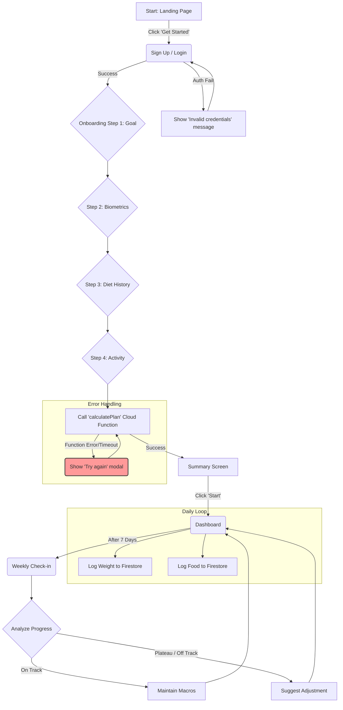

### 6. User Flow Flow-Chart

#### 6.1 Diagram Source (Mermaid)

```mermaid
graph TD
    A[Start: Landing Page] -->|Click 'Get Started'| B(Sign Up / Login);
    B -->|Success| C{Onboarding Step 1: Goal};
    B -->|Auth Fail| B_err[Show 'Invalid credentials' message];
    B_err --> B;

    C --> D{Step 2: Biometrics};
    D --> E{Step 3: Diet History};
    E --> F{Step 4: Activity};
    F --> G[Call 'calculatePlan' Cloud Function];
    
    subgraph "Error Handling"
        G -->|Function Error/Timeout| G_err(Show 'Try again' modal);
        style G_err fill:#f99,stroke:#333,stroke-width:2px;
        G_err --> G;
    end
    
    G -->|Success| H[Summary Screen];
    H -->|Click 'Start'| I(Dashboard);
    
    subgraph "Daily Loop"
        I --> J[Log Weight to Firestore];
        I --> K[Log Food to Firestore];
    end

    I -->|After 7 Days| L(Weekly Check-in);
    L --> M{Analyze Progress};
    M -->|On Track| N[Maintain Macros];
    M -->|Plateau / Off Track| O[Suggest Adjustment];
    
    N --> I;
    O --> I;
```